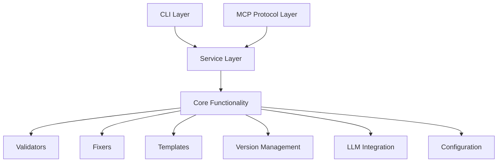
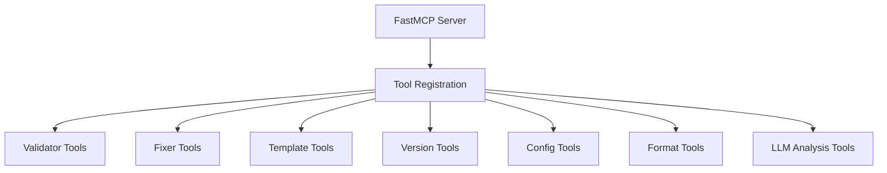
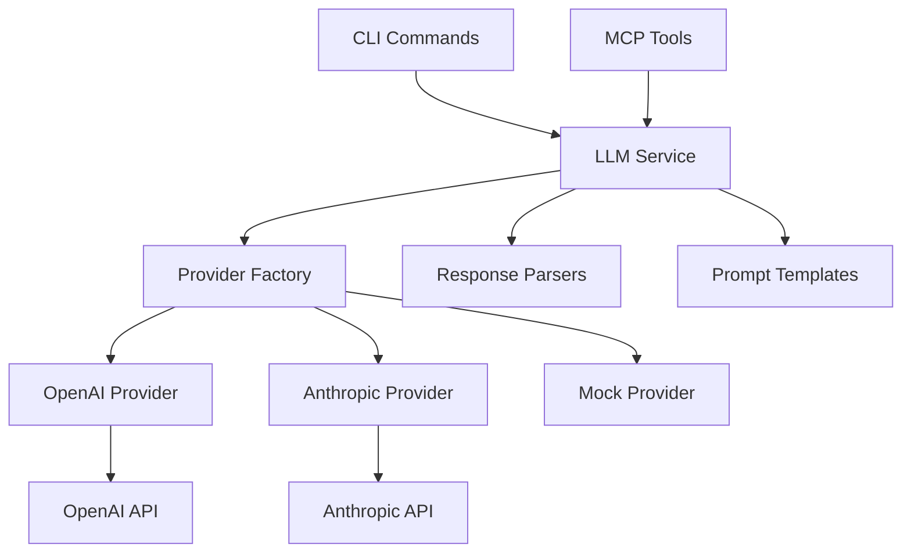
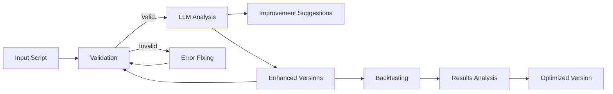
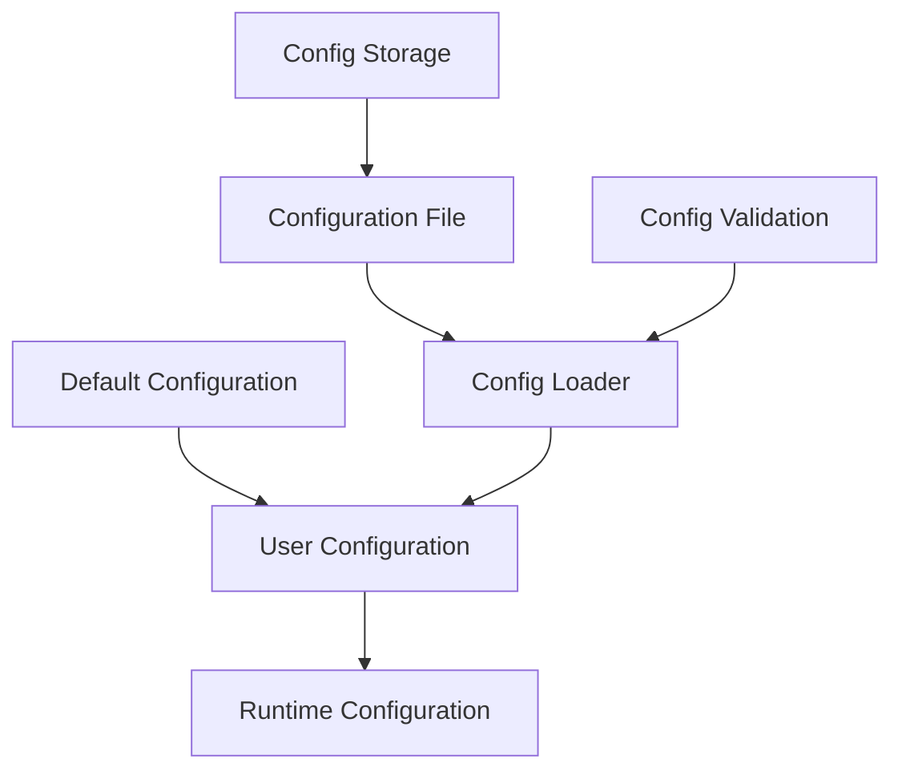

# System Patterns

This document outlines the architectural design patterns used in the PineScript MCP system and explains how components interact with each other.

## High-Level Architecture

The system follows a layered architecture with clear separation of concerns:

## Design Patterns Used

### Factory Pattern

Used in:
- **Template Creation**: Templates are created based on PineScript version and requirements
- **Provider Selection**: LLM providers are selected based on configuration settings

### Strategy Pattern

Used in:
- **Error Fixers**: Different strategies for fixing different types of errors
- **Validation Approaches**: Different validation approaches based on script type

### Observer Pattern

Used in:
- **Error Notification**: Components can subscribe to error events
- **Config Changes**: Services can observe configuration changes

### Adapter Pattern

Used in:
- **LLM Integration**: Adapting different LLM APIs to a unified interface
- **Protocol Handling**: Adapting various communication protocols to internal structures

### Singleton Pattern

Used in:
- **Configuration Manager**: Single instance for accessing configuration
- **Version Manager**: Single instance for managing versions
- **LLM Service**: Single instance for handling LLM interactions

## Component Architecture

### MCP Server

### Core Components

```mermaid
flowchart TD
    Config[Configuration System] --> UserConfig[User Config]
    Config --> SystemConfig[System Config]
    
    Validation[Validation System] --> SyntaxValidator[Syntax Validator]
    Validation --> RuleValidator[Rule Validator]
    
    Fixing[Fixing System] --> ErrorFixer[Error Fixer]
    Fixing --> DeprecationFixer[Deprecation Fixer]
    
    Templates[Template System] --> TemplateManager[Template Manager]
    Templates --> TemplateRepo[Template Repository]
    
    Versions[Version System] --> VersionDetector[Version Detector]
    Versions --> VersionConverter[Version Converter]
    Versions --> VersionManager[Version Manager]
    
    LLM[LLM Integration] --> LLMService[LLM Service]
    LLM --> Providers[Provider Implementations]
    LLM --> Analysis[Strategy Analysis]
    LLM --> Generation[Strategy Generation]
```

## LLM Integration Architecture

The LLM integration follows a modular architecture with multiple layers:

### Key Components of LLM Integration

1. **LLM Service**: Central service that coordinates interactions with language models
   - Maintains a singleton instance for application-wide access
   - Delegates to appropriate provider based on configuration
   - Handles common tasks like error handling and fallback mechanisms
   - Provides interfaces for strategy analysis, enhancement, and backtest analysis

2. **Provider Factory**: Creates and returns the configured LLM provider
   - Reads configuration to determine which provider to use
   - Initializes provider with appropriate API keys and settings
   - Falls back to mock provider if required configuration is missing or authentication fails

3. **Provider Implementations**: Concrete implementations for different LLM providers
   - **OpenAI Provider**
     - Connects to OpenAI API with robust authentication handling
     - Extracts API keys reliably from multiple sources (.env, environment variables, config)
     - Provides custom JSON response handling with error tolerance
     - Implements normalization for consistent response structures
     - Includes extensive debugging and logging
   - **Mock Provider**
     - Provides realistic but static responses for testing
     - Mimics the behavior of real providers without external dependencies
     - Allows development without API keys or costs
   - **Anthropic Provider (Planned)**
     - Will implement the common LLM provider interface for Claude models
     - Will follow the same robust error handling patterns as OpenAI

4. **Response Parsers**: Convert LLM responses into structured data
   - Parse JSON responses into typed objects
   - Handle error cases and malformed responses
   - Apply validation to ensure response integrity
   - Normalize responses for consistent handling
   - Extract relevant JSON data from potentially unstructured responses

5. **Prompt Templates**: Manage templates for different types of LLM requests
   - Strategy analysis prompts
   - Backtest analysis prompts
   - Enhancement generation prompts
   - Include examples of expected response formats
   - Clearly structure requirements for model responses

## Data Flow

## Configuration Management

The system uses a hierarchical configuration management approach:

